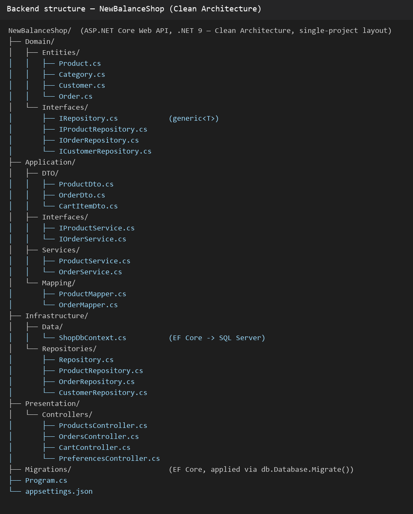
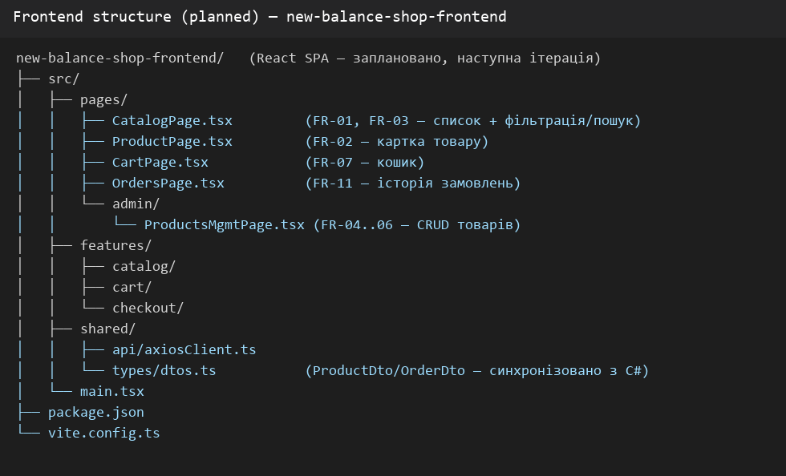
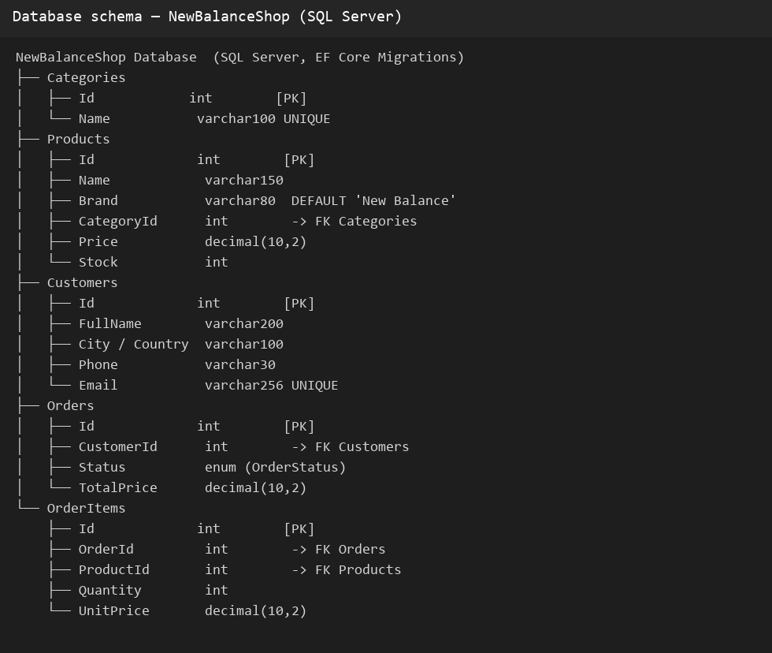
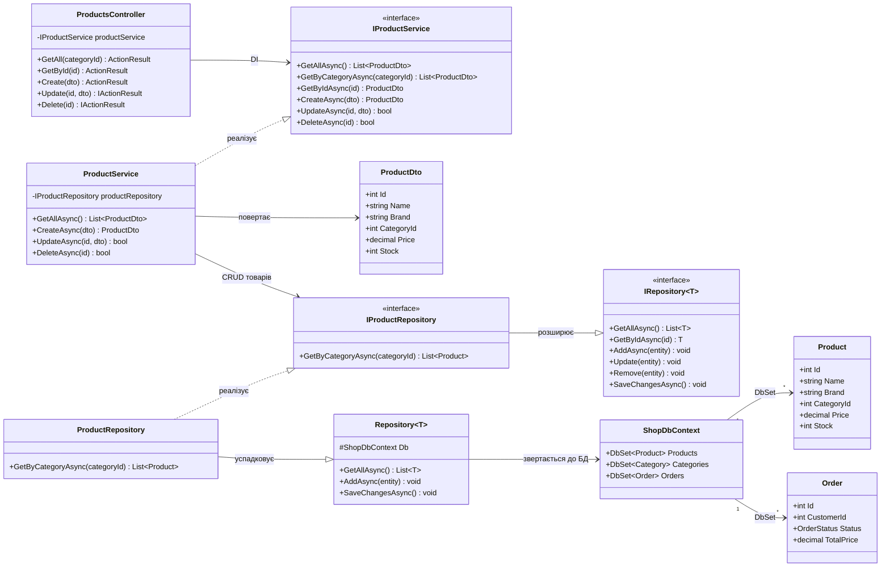

# Архітектура системи — New Balance Shop

Проєктування виконано за планом підготовки до захисту: https://gist.github.com/sunmeat/fd6d78db7e5298d3c1ee6378f4880a4d — архітектура враховує вимоги [SRS.md](../SRS.md), нижче наведено структуру backend/frontend/БД (скріни) та UML-діаграму класів з обґрунтуванням.

## 0. Скріни структури проєкту

**Backend** (реалізовано):

**Frontend** (заплановано, наступна ітерація):

**База даних** (SQL Server, EF Core Migrations):

## 1. Шари Clean Architecture

- **Presentation** (`Presentation/Controllers/`, `Program.cs`) — HTTP-шар, ApiController повертає JSON.
- **Application** (`Application/`) — сервіси (`ProductService`), DTO (`ProductDto`), мапери (`ProductMapper`).
- **Domain** (`Domain/`) — сутності (`Product`, `Category`, `Customer`, `Order`, `OrderItem`) та контракти репозиторіїв (`IRepository<T>`, `IProductRepository`, `IOrderRepository`) — без залежностей від інших шарів.
- **Infrastructure** (`Infrastructure/`) — `ShopDbContext` (EF Core → SQL Server), `Repository<T>` та похідні (`ProductRepository`, `OrderRepository`).

Напрямок залежностей: `Presentation → Application → Domain ← Infrastructure`.
Domain нічого не знає про EF Core чи ASP.NET Core — залежності інвертовано через інтерфейси репозиторіїв.

## 2. UML-діаграма класів

## 3. Чому саме така структура

- **Repository pattern**: `ProductService` не знає про EF Core — працює лише з `IProductRepository`. Якщо БД зміниться (наприклад, на PostgreSQL чи іншу ORM), достатньо переписати `ProductRepository`, сервіс і контролер лишаться незмінними.
- **DTO замість прямої серіалізації Domain-сутностей**: `ProductDto` — явний контракт API, захищає доменну модель від випадкових змін формату відповіді.
- **Generic `IRepository<T>` + специфічні інтерфейси**: `IProductRepository`/`IOrderRepository` розширюють спільний контракт власними методами (`GetByCategoryAsync`, `GetByCustomerAsync`), уникаючи дублювання базових CRUD-операцій.
