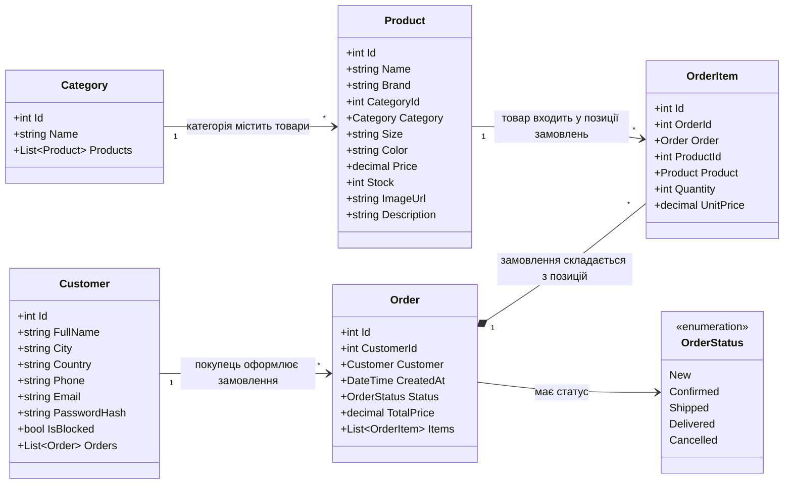

# UML-діаграма класів — Domain-моделі (New Balance Shop)

Закриття спринту 1 (завдання від 30.08.2026): діаграма охоплює лише моделі (Domain-сутності) бекенду, побудовані відповідно до [SRS.md](../../SRS.md) — щоб зняти зауваження викладача "рішення не відповідає СРС" (14.09.2026), кожен клас і зв'язок нижче прямо відповідає конкретній функціональній вимозі.

## Діаграма

## Обґрунтування кожного класу та зв'язку (вимога методички — без обґрунтування діаграма не приймається)

| Клас / зв'язок | Чому саме так | Відповідність SRS |
|---|---|---|
| `Category` | Окрема сутність, а не рядкове поле в `Product` — категорії керуються адміністратором незалежно (перейменування без зміни товарів) | FR-05 (оновлення категорій) |
| `Product` | Містить `Size`/`Color`/`Brand` як власні поля (не окрема таблиця варіантів) — свідоме спрощення для поточної ітерації, дозволяє реалізувати пошук FR-03 без додаткового JOIN | FR-01…FR-06 |
| `Category "1" --> "*" Product` | Один-до-багатьох: товар належить рівно одній категорії, категорія може містити багато товарів | FR-03 (фільтр за категорією) |
| `Customer` | Поля `City`/`Country`/`Phone`/`Email` винесені окремо (не JSON-блоб) — потрібні для прямого відображення й редагування в кабінеті покупця; `IsBlocked` замість видалення запису — зберігає історію замовлень заблокованого користувача | FR-10 (кабінет покупця), FR-13 (блокування адміністратором) |
| `Customer "1" --> "*" Order` | Один покупець — багато замовлень; `CustomerId` обов'язковий навіть для гостьової покупки (створюється "легкий" `Customer` без пароля) — так покупка лишається можливою без обов'язкової реєстрації | FR-08 (замовлення без реєстрації), FR-11 (історія замовлень) |
| `Order` + `OrderStatus` (enum) | Статус як enum, а не рядок — виключає невалідні значення на рівні компіляції, легко розширюється адміністратором через `PATCH` | FR-09 (статус замовлення) |
| `Order "1" *-- "*" OrderItem` (композиція) | `OrderItem` не існує без `Order` (видалення замовлення каскадно видаляє позиції) — на відміну від `Product`, який лишається в каталозі | FR-07 (кошик/позиції замовлення) |
| `OrderItem.UnitPrice` (копія ціни, а не посилання на `Product.Price`) | Зберігає ціну на момент покупки — якщо адміністратор пізніше змінить ціну товару, вже оформлені замовлення не "переписують" історію | NFR (цілісність історичних даних) |

## Зміни з 14.09.2026

Попередня версія моделей не мала полів `City`/`Country`/`Phone`/`IsBlocked` у `Customer`, тому не покривала FR-10/FR-13 з SRS — модель бекенду і документ вимог розходилися. Виправлено: [Domain/Entities/Customer.cs](../../Domain/Entities/Customer.cs) доповнено цими полями, додано міграцію `AddCustomerContactFields`.
